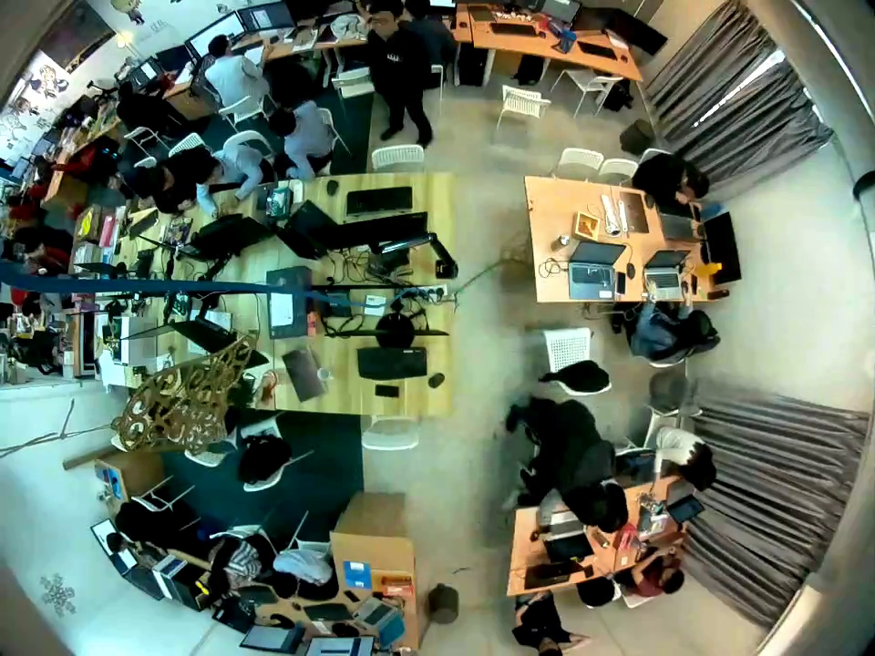
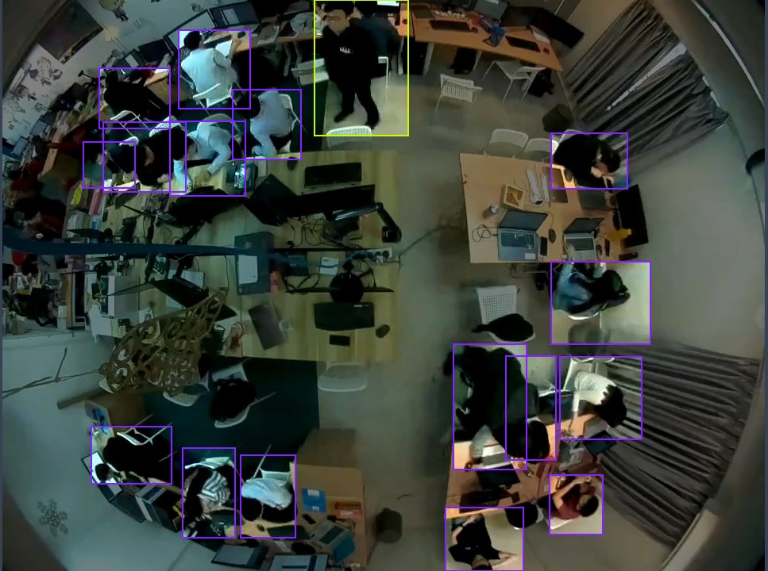
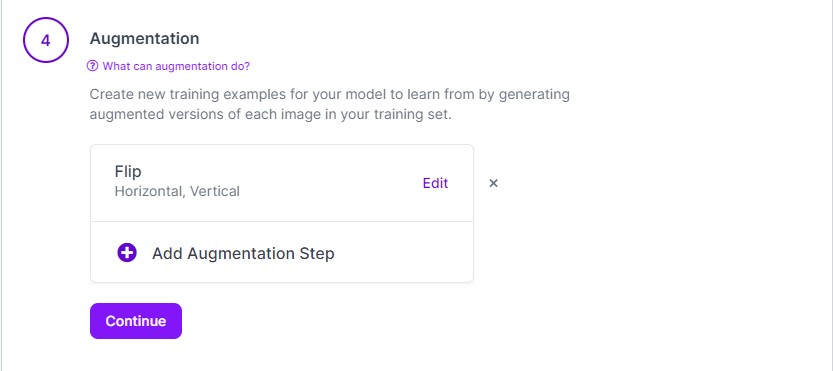
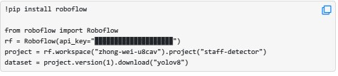
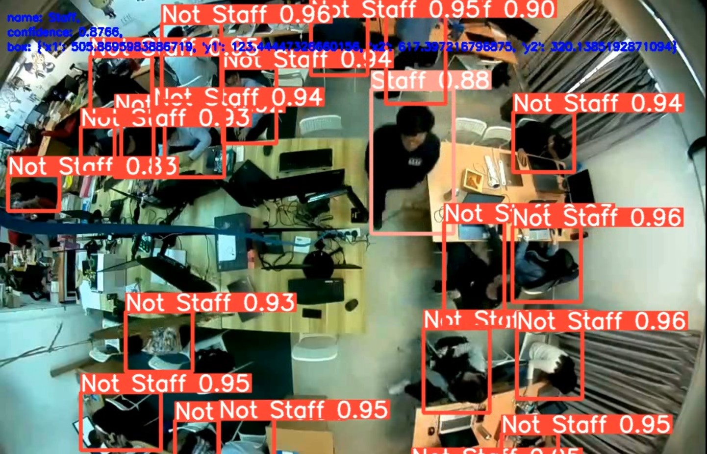

## Object Detection using YOLOv8

### 1.	Overview

In the scenario given, I have a video sample ("sample.mp4") from a 3D sensor capturing a person wearing a staff name tag walking along a corridor. The tasks assigned to me are as follows:
1.	Identify Frames with Staff Present:
My primary task is to analyse the video frames and identify the frames where a person wearing the staff name tag is present. This involves implementing a computer vision algorithm or using pre-trained models to recognize the staff name tag in each frame.
2.	[Bonus] Locate Staff XY Coordinates:
As a bonus task, I am asked to locate the XY coordinates of the staff when present in the video clip. This involves determining the position of the staff member within each frame.

### Install this repo
Before start using the model, it is required to clone the repo.
```
git clone https://github.com/ZWEILIM/Staff_Detector.git
```
Go the file location.
```
cd Staff_Detector
```
Create the virtual environment.
```
python -m venv venv
```
Activate it.
```
venv\Scripts\activate
```
Install all the requirement.
```
pip install -r requirements.txt
```


### Object Detection Workflow and usage
#### Extract frame
- Extract frame from the video using OpenCV.
```
python extract_frame.py
```
- Do the data annotation on the video labelling out the road manually.






- Perform data augmentation on both labels and original image and split them into train, test and val.




*Dataset tree structure after preprocessing.*

```
Dataset name
|
└───train
│   └───labels
│       └───frame0000_ori_png.rf.969f532607df7e8403e97ba0411db89f.txt
│   └───images
│       └───frame0000_ori_png.rf.969f532607df7e8403e97ba0411db89f.jpg
└───test
│   └───labels
│       └───frame0029_ori_png.rf.b3ca1ab666b3ea57f4bc4f8158dfcab3.jpg
│   └───images
│       └───frame0029_ori_png.rf.b3ca1ab666b3ea57f4bc4f8158dfcab3.jpg
└───val
│   └───labels
│       └───frame0026_ori_png.rf.6460d85e78ef3fbf1161b0d5583ac828.jpg
│   └───images
│       └───frame0026_ori_png.rf.6460d85e78ef3fbf1161b0d5583ac828.jpg
└───video
│   └───strample.mp4
│
└───video_frame
│   └───images
│       └───frame0000_sat.png
```

### Export dataset
Next after all of the data preprocessing step, the next step for me is to export the dataset and it is ready for the model training step.



### Training
Follow this [colab notebook](https://colab.research.google.com/drive/1Bbctd2_IFzEevqcyd11mhvBrQXkWdq4P?usp=sharing) step to train your model.

#### !!! Remeber to change to your own API key in Step 6

##### Expand dataset and iterate the training.
The dataset size is still too small in order to achieve the task, so I decided to use active learning after I have trained my first yolov8 model. I am using the self-trained model and using the auto-Annotator from this [repo](https://github.com/naseemap47/autoAnnoter). After expanding the dataset size, I keep training the model using from the previous one.

### Inference the model on video.

After training the model, I have used the model to inference it on the “sample.mp4” video and I am able to achieve the bonus task by adding the coordinates in the frame only when the person is being detect as “Staff”. 
```
python test.py 
```

### Results
After Interference with the video, the result video is being saved in your local device in .mp4 format. Here is some of the examples that the model successfully detects the staff with the input video being Interference.



